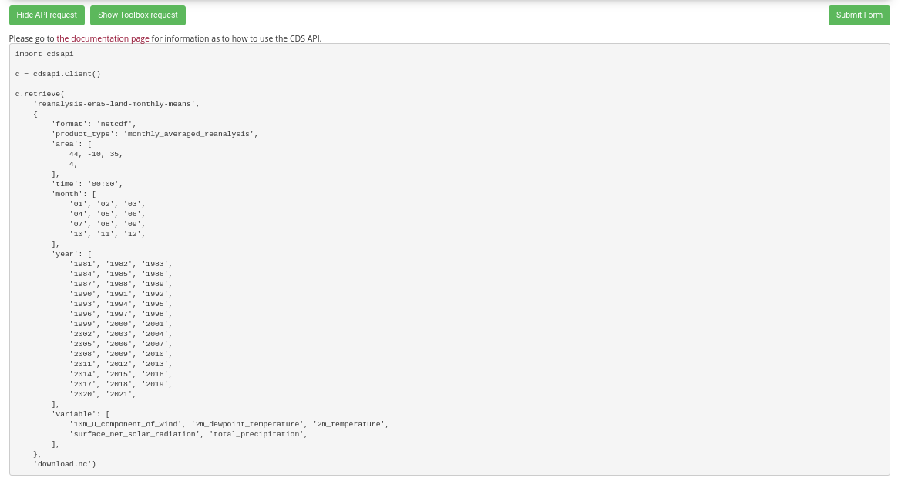
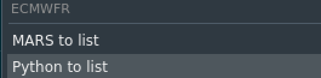

# Introduction

Copernicus Climate Data Store (CDS) offers climatic data from different sources and in different levels of
processing. This document explains step by step the recommended way of accessing the CDS programmaticaly.

# Preparation

## CDS account

Before starting to download data from CDS, we need to create a free account in the Copernicus CDS
web (https://cds.climate.copernicus.eu/user/register?destination=%2Fcdsapp%23!%2Fhome). Follow the instructions
in the web to create and confirm the new account.

After creating and login in our account, we can access the profile page (click in your user name in the top-right
corner). At the bottom of the page we will find a section called **API Key**. The UID and the API Key that
appears here are the ones we are going to need to access the data later.

For this tutorial, our credentials will be:

`UID: 0001`  
`API Key: AbCdEfG-0001-HiJkL`

Make sure you change the UID and API Key values to the ones linked to your account.

## Explore datasets

To see the available CDS datasets, we can navigate to the Datasets section
(https://cds.climate.copernicus.eu/cdsapp#!/search?type=dataset). Here we can filter by type, name... which
makes easy to find the desired dataset.  

For this tutorial we are going to use the "ERA5-Land monthly averaged data from 1981 to present" dataset, to
obtain the climatic variables for the Iberian peninsula.

### Licenses agreement

Each dataset present in the Copernicus CDS has a license we need to agree with in order to be able to download
the data. This has to be done **once** in the CDS web after triggering a manual download. Once we have done this,
we don't need to repeat this step for datasets with the same kind of license, but if we want to download
another dataset with a different license we will have to accept that license as weel in a manual download.

## Installing needed packages

For accessing CDS we will need the `ecmwfr` and the `keyring` packages. If they are not installed, we can
install them as usual:


```r
remotes::install_cran(c('ecmwfr', 'keyring'))
```

Now we can load them:


```r
library(ecmwfr)
library(keyring)
```

## Setting UID and API Key

  > Both, UID and API Key, are very sensible and personal information, and shouldn't be included in any script
  we share with others or make public in git repositories or similar. The same way, they shouldn't be stored
  as plain text files for security reasons.

To set our UID and API KEy to be able to use CDS Services, we need to use the `ecmwfr::wf_set_key()` function:


```r
wf_set_key(
  user   = "0001",
  key   = "AbCdEfG-0001-HiJkL",
  service = 'cds'
)
```

`user` is the UID, `key` is the API Key, and `service` indicates that we want to access the Copernicus CDS
service. THis has to be done **every** new R session, as the user-key pairs are stored temporarily as
environment variables.

# Downloading CDS data

## Creating the request

Now that we have licenses accepted, user and key setted and all the packages we need, we can start downloading
CDS datasets with the `ecmwfr::wf_request()` function, but first we need to create the request list, a list of
parameters that describe the data and its characteristics:


```r
request <- list(
  format = "netcdf",
  product_type = "monthly_averaged_reanalysis",
  area = c(44, -10, 35, 4),
  time = "00:00",
  month = c("01", "02", "03", "04", "05", "06", "07", "08", "09", "10", "11", "12"),
  year = c("1981", "1982", "1983", "1984", "1985", "1986", "1987", "1988", "1989", "1990", "1991", "1992", "1993", "1994", "1995", "1996", "1997", "1998", "1999", "2000", "2001", "2002", "2003", "2004", "2005", "2006", "2007", "2008", "2009", "2010", "2011", "2012", "2013", "2014", "2015", "2016", "2017", "2018", "2019", "2020", "2021"),
  variable = c("10m_u_component_of_wind", "2m_dewpoint_temperature", "2m_temperature", "surface_net_solar_radiation", "total_precipitation"),
  dataset_short_name = "reanalysis-era5-land-monthly-means",
  target = "download.nc"
)
```

  - `format`: The desired output format, it depends on the formats available in the datasets, some only offer
  GRIB (zip files), whereas others offer also NetCDF files. Choose accordingly to the available formats.
  - `variable`: Character vector with the desired variable names or `all` for accesing all variables.
  - `month`, `year` and `time`: Character vectors with the desired months, year and times (hours) to download.
  - `area`: Numeric vector with the bbox of the desired area, in the form of
  `c(max_lat, min_long, min_lat, max_lat)`.
  - `target`: Output file name
  - `dataset_short_name`: Dataset short name as stated in the CDS product web page.
  - `product_type`: Some datasets have more than one product type, choose the one desired.
  
  > Take into account that parameters of the request can change depending on the dataset. It is always advisable
  to explore the data download webpage at CDS when first downloading a new dataset, to get the grasp of it
  before trying the API, see next section.

### Getting help with the request

Sometimes, especially the first times we are using the CDS API, we don't know exactly how to write the
request options. `ecmwfr` package offers an *addin* in RStudio that converts the API request in the
CDS product webpage to the correct format:





Addin help us to convert between MARS/Python formats to R request list. In the case of the CDS, we need to
convert from Python.  
After using the addin, the resulting request is as follows:


```r
request <- list(
  format = "netcdf",
  product_type = "monthly_averaged_reanalysis",
  area = c(44, -10, 35, 4),
  time = "00:00",
  month = c("01", "02", "03", "04", "05", "06", "07", "08", "09", "10", "11", "12"),
  year = c("1981", "1982", "1983", "1984", "1985", "1986", "1987", "1988", "1989", "1990", "1991", "1992", "1993", "1994", "1995", "1996", "1997", "1998", "1999", "2000", "2001", "2002", "2003", "2004", "2005", "2006", "2007", "2008", "2009", "2010", "2011", "2012", "2013", "2014", "2015", "2016", "2017", "2018", "2019", "2020", "2021"),
  variable = c("10m_u_component_of_wind", "2m_dewpoint_temperature", "2m_temperature", "surface_net_solar_radiation", "total_precipitation"),
  dataset_short_name = "reanalysis-era5-land-monthly-means",
  target = "download.nc"
)
```

## Downloading the data

Finally, we are ready to download the data:


```r
nc_file <- wf_request(
  user = "0001",
  request = request,   
  transfer = TRUE,  
  path = ".",
  verbose = TRUE
)

stars::read_stars(nc_file)
```


```
## u10, d2m, t2m,
```

```
## stars object with 3 dimensions and 3 attributes
## attribute(s):
##    u10 [m/s]         d2m [K]          t2m [K]      
##  Min.   :-5.40    Min.   :261.0    Min.   :266.9   
##  1st Qu.:-0.04    1st Qu.:276.3    1st Qu.:280.9   
##  Median : 0.36    Median :279.7    Median :285.3   
##  Mean   : 0.36    Mean   :279.8    Mean   :286.3   
##  3rd Qu.: 0.81    3rd Qu.:283.0    3rd Qu.:291.6   
##  Max.   : 4.05    Max.   :294.2    Max.   :303.1   
##  NA's   :120000   NA's   :120000   NA's   :120000  
## dimension(s):
##      from  to offset delta  refsys point                    values x/y
## x       1 141 -10.05   0.1      NA    NA                      NULL [x]
## y       1  91  44.05  -0.1      NA    NA                      NULL [y]
## time    1  24     NA    NA POSIXct    NA 1991-01-01,...,1992-12-01
```

